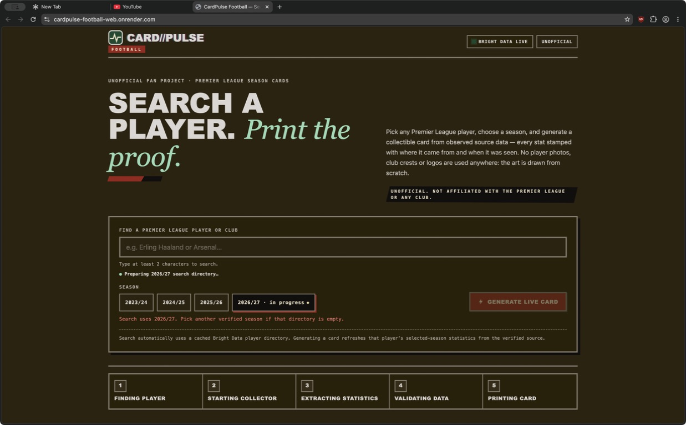
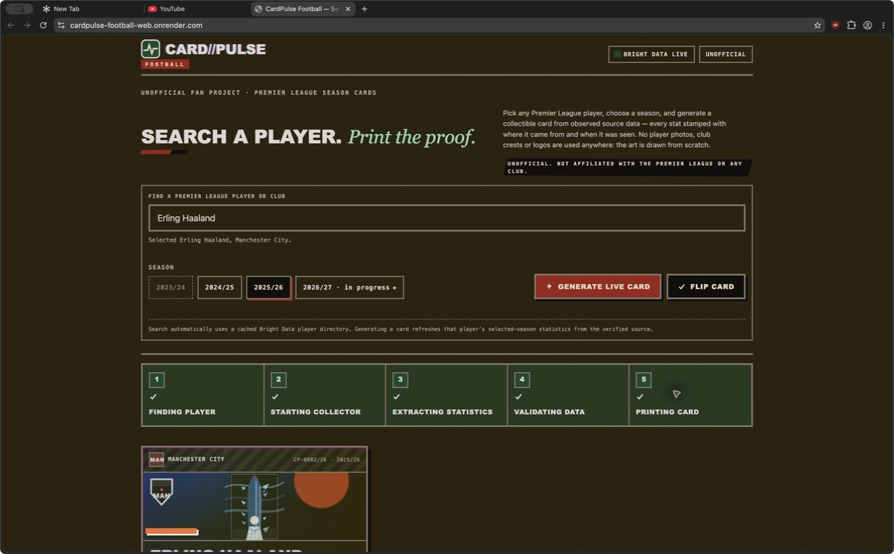
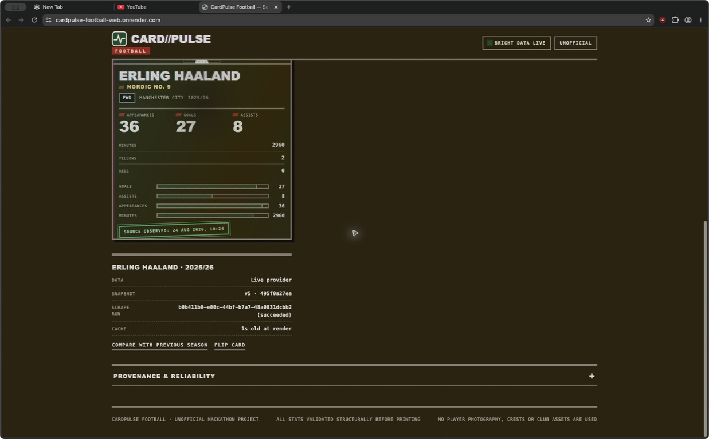
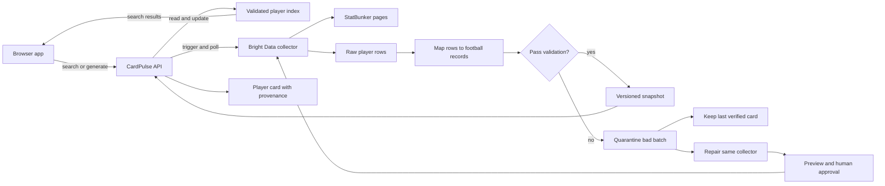

# CardPulse Football

[](https://github.com/UddhavB17/cardpulse-football/actions/workflows/ci.yml)
[](https://cardpulse-football-web.onrender.com)

Search for a Premier League player, choose a season, and print a collectible
card from verified football statistics.

CardPulse is a small full-stack project with one simple idea: football data
should be fun to explore, but the numbers should still be explainable. Each
card keeps the source, the time it was collected, and the scrape run that
produced it.

## See it in action

Open the [live demo](https://cardpulse-football-web.onrender.com), search for
any player, choose a season, and select **Generate live card**.

<table>
  <tr>
    <td width="50%"></td>
    <td width="50%"></td>
  </tr>
  <tr>
    <td align="center">Search and choose a season</td>
    <td align="center">Generate a live player card</td>
  </tr>
</table>

<p align="center">
  
</p>

The screenshots are point-in-time examples. Live football data can change as
the source publishes new matches or corrections.

## What the project does

1. The browser prepares a verified player directory.
2. You search by player or club name.
3. You choose one of the supported Premier League seasons.
4. You generate a card with one clear action.
5. The API collects and checks the player statistics.
6. The card shows totals, match history, and data provenance.

The browser never asks for a Bright Data token. Provider credentials stay on
the API server.

## Why the scraper matters

StatBunker is a public football statistics site. Its HTML can change, and a
scraper can fail even when the football data is still there.

CardPulse treats scraping as a data pipeline:

- invalid rows are rejected instead of being turned into fake zeroes;
- the last verified card stays visible if a new collection fails;
- the exact player ID and season are checked before a card is printed;
- layout drift can be repaired in the same Bright Data collector;
- a repair needs a valid preview and human approval before rerunning.

The card is the visible result. The trust checks are the part that keeps it
honest.

## System architecture



Read the full explanation in [docs/architecture.md](docs/architecture.md).

### The pieces

| Folder                                                   | What it does                                                                               |
| -------------------------------------------------------- | ------------------------------------------------------------------------------------------ |
| [`apps/web`](apps/web)                                   | The search box, season picker, card, provenance panel, and reliability timeline.           |
| [`services/collector-worker`](services/collector-worker) | The API, collection flow, validation, snapshots, caching, and healing logic.               |
| [`packages/brightdata`](packages/brightdata)             | The Bright Data trigger and polling client plus StatBunker row mapping.                    |
| [`packages/contracts`](packages/contracts)               | Shared Zod schemas for players, matches, cards, and API responses.                         |
| [`packages/validation`](packages/validation)             | Stable serialization, hashes, and extraction checks.                                       |
| [`apps/chaos-source`](apps/chaos-source)                 | A local test page that can simulate normal HTML, layout drift, changed stats, or downtime. |

### A card request in plain English

1. The browser sends a player ID and season to the API.
2. The API checks the season against the verified registry.
3. The collector gets the player match page. If the index has no usable ID,
   the collector first resolves one exact player ID from the public search page.
4. Every returned row must belong to that player and season.
5. Valid rows become a versioned snapshot with a SHA-256 hash.
6. The API returns the card and its provenance to the browser.

## Supported seasons

CardPulse only uses seasons that are explicitly listed in the source registry.
It never guesses a StatBunker URL for an unknown season.

| Season  | StatBunker `comp_id` | Status                 |
| ------- | -------------------: | ---------------------- |
| 2023/24 |                  745 | Complete               |
| 2024/25 |                  596 | Complete               |
| 2025/26 |                  776 | Complete               |
| 2026/27 |                  791 | Current and incomplete |

The current season may have fewer completed matches. CardPulse labels missing
history instead of filling it with invented values.

## Run it locally

### Requirements

- Node.js 22 or newer
- pnpm 11 or newer

### Install

```bash
corepack enable
pnpm install
cp .env.example .env
```

Blank provider credentials use safe local mock mode.

### Start the app

Run these commands in three terminals:

```bash
pnpm dev:chaos-source
pnpm start:api
pnpm dev:web
```

Then open <http://127.0.0.1:4173>.

Useful local URLs:

- Web app: <http://127.0.0.1:4173>
- API: <http://127.0.0.1:4321>
- Scraper test page: <http://127.0.0.1:4311/players>
- Scraper test controls: <http://127.0.0.1:4311/__control>

The local source controls can switch between these modes:

- `baseline-table`: normal table markup
- `drift-cards`: the same data in a different layout
- `amended-stats`: valid data with a real change
- `unavailable`: a source failure

## Bright Data setup

Live collection is optional. To use it, set these server-side variables in
`.env`:

```dotenv
BRIGHT_DATA_API_TOKEN=
BRIGHT_DATA_COLLECTOR_ID=
BRIGHT_DATA_TARGET_URL=
CARDPULSE_ENABLE_LIVE_MUTATIONS=false
CARDPULSE_OPERATOR_TOKEN=
```

Never commit `.env`, a token, or an operator secret. The browser does not need
any of these values.

For the full live setup and scraper notes, see:

- [Local development](docs/local-development.md)
- [StatBunker runbook](docs/statbunker-live-runbook.md)
- [StatBunker scraper notes](scrapers/statbunker/README.md)

## Test and build

Run the complete project check with:

```bash
pnpm check
```

This runs formatting checks, linting, type checks, tests, builds, and the
deterministic collector demo.

Useful focused commands:

```bash
pnpm test
pnpm typecheck
pnpm build
pnpm demo:collector
```

## Important limits

- Runtime state is in memory. Restarting the API clears local snapshots.
- The current-season data is partial until all matches are complete.

## More documentation

- [System architecture](docs/architecture.md)
- [API contract](docs/api-contract.md)
- [Searchable card demo guide](docs/searchable-card-demo.md)
- [Render deployment](docs/render-deployment.md)
- [Evidence folder](evidence/README.md)

## License and attribution

The local demo fixtures are fictional and used for testing. The project model
is inspired by public football data formats, including
[OpenLigaDB](https://www.openligadb.de/). Review the source terms before using
CardPulse with live data.
