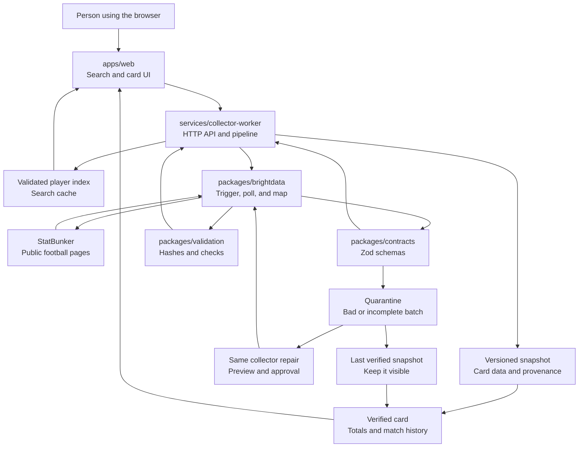

# CardPulse architecture

This page explains how CardPulse turns a player search into a verified football
card. It uses the same names as the folders in the repository.

## Overview

## What happens during search

Search is designed to feel instant without making a paid provider request for
every character typed.

1. The API prepares one verified season index when it is cold.
2. Bright Data collects the StatBunker player standings page.
3. The API validates the returned rows and stores a local search index.
4. Player and club searches read that index.
5. Concurrent index requests share the same preparation instead of starting
   duplicate collections.

The browser never receives a Bright Data credential.

## What happens during generation

Generation is an explicit action because it may start a live collection.

1. The browser sends a selected player and verified season.
2. The API checks that the season is in the registry.
3. If the player index has a numeric StatBunker ID, the collector requests the
   player-specific `SeasonMatches` page.
4. If the index only has a list row, the collector uses the exact-name search
   branch. It must prove exactly one numeric player ID before continuing.
5. The mapper converts each returned row into the shared football model.
6. Strict contracts check identity, season, dates, scores, and statistics.
7. A valid batch becomes a versioned snapshot with source metadata and a
   payload hash.
8. The browser renders totals, match history, and provenance.

## What happens when the source changes

The local chaos source makes this easy to test. It can keep the same football
data while changing the HTML layout, amend a statistic, or return an outage.

- A malformed row is quarantined.
- A failed batch cannot replace a verified card.
- A confirmed layout change can start a repair for the same Bright Data
  collector.
- The repaired collector must produce a valid preview.
- A human approves the preview before the collector is rerun.
- Recovery evidence records the result.

This is why the last verified card stays on screen during a scraper failure.

## Repository boundaries

### `apps/web`

The browser application. It owns the search combobox, season picker, card
front, card back, provenance drawer, reliability timeline, and accessibility
behavior.

### `services/collector-worker`

The API and the main workflow. It owns index preparation, generation runs,
cache freshness, snapshots, quarantine, source health, and healing routes.

### `packages/brightdata`

The external provider boundary. It sends collection requests, polls for
results, maps StatBunker rows, and handles the same-collector repair flow.

### `packages/contracts`

The shared data contract. Zod schemas make the accepted shape explicit for
players, teams, standings, matches, cards, snapshots, and API responses.

### `packages/validation`

Stable serialization, hashes, and extraction checks. Snapshot hashes ignore
observation time so the same football data does not create a fake new version.

### `apps/chaos-source`

A local source simulator for testing normal pages, layout drift, changed
statistics, and outages without relying on a live website.

## Trust and security boundaries

- Provider tokens are server-side environment variables.
- The browser talks to the API, not directly to Bright Data.
- The public live mutation switch is explicit and disabled in local mock mode.
- Healing and development routes require a separate operator token.
- Unknown seasons fail closed instead of producing guessed URLs.
- The application uses original art and does not download player photos or
  club marks.

## Current scope

CardPulse is intentionally small. It does not include a database, durable job
queue, login system, scheduler, or background score polling. Runtime snapshots
are held in memory, and current-season history can be incomplete while the
football season is still being played.
