# Architecture

CardPulse is a football-domain application built around a provider-neutral
reliability pipeline, a Bright Data Scraper Studio boundary, and — on this
branch — a searchable Premier League card generator on top of both.

## Data flow

```mermaid
flowchart LR
  Query[Player search query] --> Idx[Local cached player index]
  Refresh[Explicit protected season refresh] --> BD
  BD --> Idx
  Idx --> Pick[player + verified season]
  Pick --> Gen{Explicit generate}
  Gen -->|cache hit| Snap[Existing validated snapshot]
  Gen -->|cache miss / forced refresh| Resolve{numeric player ID cached?}
  Resolve -->|yes| BD[Bright Data collector c_*]
  Resolve -->|no: exact-name input| BD
  BD --> Rows[Raw row batch]
  Rows --> Map[Football row mapper]
  Map --> Validate{Strict contract}
  Validate -->|valid| Snapshot[Versioned snapshot]
  Validate -->|invalid| Quarantine[Quarantine + payload hash]
  Snapshot --> Diff[Deterministic semantic diff]
  Snap --> Card[CardPulse UI: front/back card]
  Diff --> API[Players / teams / standings / changes API]
  API --> Card
  Quarantine --> Gate{Confirmed batch drift?}
  Gate -->|no| Preserve[Keep last verified card]
  Gate -->|yes| Refactor[Refactor same c_* collector]
  Refactor --> Preview[Schema + count preview]
  Preview --> Approval[Human approval]
  Approval --> Rerun[Rerun same c_* collector]
  Rerun --> Evidence[Recovery hashes and counts]
  Evidence --> API
```

## Searchable card generator

The one-player demo became search → season → generate:

- **Search index.** Player name lookup is served from a local cached index
  built from already-collected data. It never calls Bright Data per keystroke;
  typing is free and offline-safe.
- **Season registry.** Only the verified StatBunker Premier League seasons are
  selectable (2023/24 `comp_id=745`, 2024/25 `596`, 2025/26 `776`,
  2026/27 `791` at
  `https://www.statbunker.com/competitions/PlayerStandings?comp_id=<id>`).
  Unknown seasons fail closed: no URL is guessed and no collection runs.
  2026/27 is current and incomplete, so its match availability may be partial
  and the card says so rather than filling gaps.
- **Generation.** One explicit action per generation. With a proven numeric
  player ID, a fresh real collection targets the selected player's verified
  `SeasonMatches` URL. A list-only identity instead uses the public exact-name
  search URL as the collector input; the same run must prove exactly one
  numeric ID, navigate its canonical season-match URL, and repeat both on
  every row. Either way there is one billable trigger → poll → map every match
  → validate/quarantine → derive totals, or a cache hit. The response and run
  status record which path produced the card.
- **Async run status.** Generation returns a run identifier immediately and
  clients poll scrape status. Stages are reported truthfully — including the
  exact failing stage — and a failed or quarantined collection never becomes
  fixture/demo data. The last verified card stays visible until a valid new
  snapshot replaces it.

## Cache freshness

Cached cards are previously collected snapshots, not guesses: a hit serves the
last validated snapshot with its original provenance (source URL, season,
snapshot version, hash, observed time), and staleness is shown, not hidden.
An explicit protected index refresh and a stale/missing generation are the
only billable paths; both go through the same validation, quarantine, and
batch-level healing gates as any live run. Freshness is checked on an explicit
Generate action with a default 15-minute TTL; there is no background scheduler.
Because StatBunker updates after match completion, CardPulse is post-match
freshness rather than second-by-second score tracking.

If exact-name resolution or player-specific match extraction drifts, its
source ID retains the exact resolver/match target and selected player-season
context in process memory. The protected healing routes accept that source
ID, require the repaired preview to prove the same exact numeric identity and
canonical match URL, preserve the human approval gate, and rerun the same
collector against the same target before recording recovery evidence.

## Snapshot provenance

Every generated card carries its snapshot lineage: source ID and URL shape,
season/`comp_id`, mapper acceptance, snapshot version, and SHA-256 payload
hash. Comparison views keep each season's provenance separate so a cached
2024/25 card can never be confused with a freshly collected 2025/26 card.

## Match history and unavailability

Generation validates the selected player's season-bound completed-match rows
and derives card totals from the accepted set. The incomplete 2026/27 season
may legitimately contain fewer matches than a completed campaign. When the
source publishes no usable rows, the card keeps its last verified version and
the match panel reports the gap instead of inventing fixtures or zero-filling.

## Boundaries

### `packages/contracts`

The single source of truth. Runtime Zod schemas and inferred TypeScript types
cover:

- `PlayerCard`: identity, club, position, season, appearances, goals, assists,
  cards, and minutes;
- `PlayerMatchRecord`: player/season-bound match identity, score, appearance,
  goals, assists, minutes, and discipline;
- `TeamSummaryRecord`: public club metadata;
- `StandingEntry`: rank, record, goals, and points, including arithmetic
  consistency checks;
- `FootballSnapshot`, `FootballChangeEvent`, `QuarantinedExtraction`,
  `SourceHealth`, and `RecoveryEvidence`;
- typed, paginated API envelopes.

All schemas are strict. Unknown output fields fail closed.

### `packages/brightdata`

Owns the external HTTP boundary and football row mapper. Collection calls
`/dca/trigger` with `queue_next=1`, captures `collection_id`, and polls
`/dca/dataset`. Healing uses the same first-class `c_*` collector for
`refactor_template`, structured progress/preview, and
`resume_automation_job`. Requests have time bounds, retry only transient
failures, and expose sanitized typed errors.

### `services/collector-worker`

Owns validation, in-memory stores, batch drift classification, semantic
diffing, source health, the healing coordinator, and the HTTP API.

Snapshot hashes exclude `observedAt`, so another successful poll of identical
business data updates health without manufacturing a new material version.
One malformed row is quarantined but cannot trigger a repair. An empty first
run also cannot trigger a repair. Healing requires a verified count collapse,
a structural majority after a baseline, or a repeated structural signature
before a baseline exists.

### `apps/chaos-source`

Provides one stable public path, `/players`. Its controlled states are
`baseline-table`, `drift-cards`, `amended-stats`, and `unavailable`. The first
two contain identical business data in different DOM structures. The control
route is local demo tooling and must not be exposed publicly.

### `apps/web`

Consumes the typed API and renders the searchable card experience: ARIA
combobox player search, verified-season picker, front/back cards with explicit
flip, season comparison, run-status display, team summaries, standings,
provenance, quarantine, healing state, and recovery evidence. The UI labels
mock/live/demo truth explicitly — demo output keeps a persistent
`DEMO DATA` label — honors `prefers-reduced-motion`, and works by keyboard and
touch without photos, logos, or shot coordinates.

## Frozen contracts

Search results, season entries, generation runs, scrape status stages, and
generated cards all cross strict Zod schemas in `packages/contracts`. Unknown
fields fail closed, stage names are a closed vocabulary, and cached versus
freshly collected provenance is part of the contract — so UI code cannot blur
the line between a live collection, a cache hit, or demo data.

## Security and MVP limits

- State is in memory and resets when the process stops.
- There is no scheduler, durable queue/database, account system, or alerting.
- Live mutations require an explicit flag and a strong operator token; these
  controls are still local hackathon surfaces, not production authentication.
- Provider credentials are environment-only. The operator token may be entered
  into the local browser UI; it stays in tab memory, is sent only on protected
  mutations, and is never included in response bodies or persistent storage.
- Tests use deterministic providers. Live Bright Data behavior needs a
  separately captured credentialed evidence trail before it is claimed.
