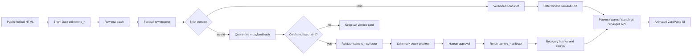

# Architecture

CardPulse is a football-domain application built around a provider-neutral
reliability pipeline and a Bright Data Scraper Studio boundary.

## Data flow

## Boundaries

### `packages/contracts`

The single source of truth. Runtime Zod schemas and inferred TypeScript types
cover:

- `PlayerCard`: identity, club, position, season, appearances, goals, assists,
  cards, and minutes;
- `TeamSummaryRecord`: public club metadata;
- `StandingEntry`: rank, record, goals, and points, including arithmetic
  consistency checks;
- `FootballSnapshot`, `FootballChangeEvent`, `QuarantinedExtraction`,
  `SourceHealth`, and `RecoveryEvidence`;
- typed, paginated API envelopes.

All schemas are strict. Unknown output fields fail closed.

### `packages/brightdata`

Owns the external HTTP boundary and football row mapper. Collection calls
`/dca/trigger` with `queue_next=1`, captures `collection_id`, and polls
`/dca/dataset`. Healing uses the same first-class `c_*` collector for
`refactor_template`, structured progress/preview, and
`resume_automation_job`. Requests have time bounds, retry only transient
failures, and expose sanitized typed errors.

### `services/collector-worker`

Owns validation, in-memory stores, batch drift classification, semantic
diffing, source health, the healing coordinator, and the HTTP API.

Snapshot hashes exclude `observedAt`, so another successful poll of identical
business data updates health without manufacturing a new material version.
One malformed row is quarantined but cannot trigger a repair. An empty first
run also cannot trigger a repair. Healing requires a verified count collapse,
a structural majority after a baseline, or a repeated structural signature
before a baseline exists.

### `apps/chaos-source`

Provides one stable public path, `/players`. Its controlled states are
`baseline-table`, `drift-cards`, `amended-stats`, and `unavailable`. The first
two contain identical business data in different DOM structures. The control
route is local demo tooling and must not be exposed publicly.

### `apps/web`

Consumes the typed API, renders player cards, team summaries, standings,
provenance, quarantine, healing state, and recovery evidence. The UI labels
mock and live truth explicitly and keeps data stable while chrome/glitch
effects communicate a compromised source.

## Security and MVP limits

- State is in memory and resets when the process stops.
- There is no scheduler, durable queue/database, account system, or alerting.
- Live mutations require an explicit flag and a strong operator token; these
  controls are still local hackathon surfaces, not production authentication.
- Credentials are environment-only and never included in response bodies.
- Tests use deterministic providers. Live Bright Data behavior needs a
  separately captured credentialed evidence trail before it is claimed.
